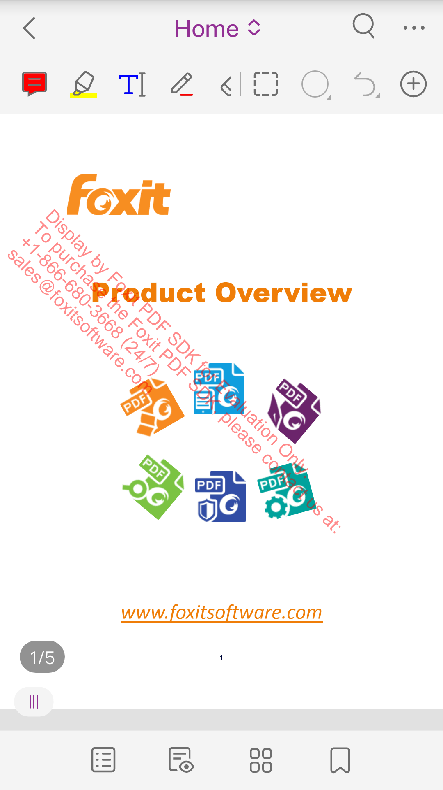

# Foxit PDF SDK Flutter Wrapper

A new flutter for using Foxit PDF SDK to open a pdf document.

- [System Requirements](#System-Requirements)
- [Installation](#Installation)
  - [Android](#Android)
  - [iOS](#iOS)
- [Usage](#Usage)
- [Preview](#Preview)
- [API Reference](#API-Reference)
- [Issues](#Issues)

## System Requirements

-  Foxit PDF SDK >= 6.2.1

		For Android  >= 6.2.1, After v7.2 only support AndroidX versions.
		For IOS >= 7.1
    
-  Flutter >= 1.0.0

## Installation

### Android

1. Follow the Flutter getting started guides to [install](https://flutter.io/docs/get-started/install), [set up an editor](https://flutter.io/docs/get-started/editor), and [create a Flutter Project.](https://flutter.io/docs/get-started/test-drive?tab=terminal#create-app) , assume you create `testflutter` as your project.

2. Download [Foxit PDF SDK for Android](https://developers.foxitsoftware.com/pdf-sdk/android/) package, extract it, and copy the following files (libraries and licenses) in the "libs" folder of the extracted package to `testflutter\android\libs` directory:

		FoxitRDK.aar
		FoxitRDKUIExtensions.aar
		RMSSDK-4.2-release.aar
		rms-sdk-ui.aar
		FoxitMobileScanningRDK.aar
		FoxitPDFScan-UI.aar
		rdk_key.txt
		rdk_sn.txt

3. Add dependency to your Flutter project in `testflutter/pubspec.yaml`. 
```diff
		dependencies:
	  		flutter:
	    		  sdk: flutter
	
+	                flutter_foxitpdf:
+  		          git:
+    		           url: git://github.com/foxitsoftware/flutter-foxitpdf.git
```

4. Run `flutter packages get`

5. Adjust `testflutter/android/build.gradle` file.
```diff
		allprojects {
		    repositories {
		        google()
		        jcenter()
+ 		        flatDir {
+                           dirs project(':flutter_foxitpdf').file("$rootDir/libs")
+ 		       }
		    }
		}
```

6. Adjust `testflutter/android/app/src/main/AndroidManifest.xml` file
```diff
        <manifest xmlns:android="http://schemas.android.com/apk/res/android"
+             xmlns:tools="http://schemas.android.com/tools"
              package="com.foxitreact">
	
	    <application
	        android:name="io.flutter.app.FlutterApplication"
	        android:label="testflutter"
	        android:icon="@mipmap/ic_launcher"
+	        tools:replace="android:label">
```

7. Replace `lib/main.dart`, see [Usage](#usage)

8. Run, You can run this prject in `Android Studio` or by using `flutter run`

9. You may also clone the plugin and run `example` in the project. You need to copy the `libs` to `example/libs` directory.

### iOS

1. Follow the Flutter getting started guides to [install](https://flutter.io/docs/get-started/install), [set up an editor](https://flutter.io/docs/get-started/editor), and [create a Flutter Project.](https://flutter.io/docs/get-started/test-drive?tab=terminal#create-app) , assume you create `testflutter` as your project.

2. Download [Foxit PDF SDK for IOS](https://developers.foxitsoftware.com/pdf-sdk/ios/) package, extract it, and copy the following files (libraries and licenses) in the "libs" folder of the extracted package to `testflutter\ios\libs` directory:

        FoxitRDK.framework
        uiextensionsDynamic.framework
		FoxitPDFScanUI.framework (v8.0)
        rdk_key.txt
        rdk_sn.txt

3. Add dependency to your Flutter project in `testflutter/pubspec.yaml`. 
```diff
        dependencies:
              flutter:
                sdk: flutter
    
+             flutter_foxitpdf:
+               git:
+                url: git://github.com/foxitsoftware/flutter-foxitpdf.git
```

4. Run `flutter pub get`.

5. Adjust `testflutter/ios/Podfile` file
```diff
        # Uncomment this line to define a global platform for your project
+           platform :ios, '11.0'
       ......  
            target 'Runner' do
            ......
+           #Foxit pods
+           use_frameworks!
+           pod 'FoxitPDF', :path=>'./libs/FoxitPDF.podspec'
```

6. Run `flutter build ios --no-codesign`.

7. Replace `lib/main.dart`, see [Usage](#usage)

8. Run, You can run this prject in `Xcode` or by using `flutter run`

9. You may also clone the plugin and run `example` in the project. You need to copy the `libs` to `example/ios/libs` directory.

## <span id="usage">Usage</span>

Replace `YOUR_RDK_SN` and `YOUR_RDK_KEY` with your own license (`rdk_key.txt, rdk_sn.txt`)

```dart

	import 'dart:typed_data';
	
	import 'package:flutter/material.dart';
	import 'dart:async';
	
	import 'package:flutter/services.dart';
	import 'package:flutter_foxitpdf/flutter_foxitpdf.dart';
	
	void main() => runApp(MyApp());
	
	class MyApp extends StatefulWidget {
	  @override
	  _MyAppState createState() => _MyAppState();
	}
	
	class _MyAppState extends State<MyApp> {
	  String _platformVersion = 'Unknown';
	  int _error = -1;
	
	  String _sn = 'YOUR_RDK_SN';
	  String _key = 'YOUR_RDK_KEY';
	  String _path = 'YOUR_PDF_FILE';
	
	  @override
	  void initState() {
	    super.initState();
	    initPlatformState();
	
	    init(_sn, _key);
	
	    openDocument(_path, "");
	  }
	
	  // Platform messages are asynchronous, so we initialize in an async method.
	  Future<void> initPlatformState() async {
	    String platformVersion;
	    // Platform messages may fail, so we use a try/catch PlatformException.
	    try {
	      platformVersion = await FlutterFoxitpdf.platformVersion;
	    } on PlatformException {
	      platformVersion = 'Failed to get platform version.';
	    }
	
	    // If the widget was removed from the tree while the asynchronous platform
	    // message was in flight, we want to discard the reply rather than calling
	    // setState to update our non-existent appearance.
	    if (!mounted) return;
	
	    setState(() {
	      _platformVersion = platformVersion;
	    });
	  }
	
	  @override
	  Widget build(BuildContext context) {
	    return MaterialApp(
	      home: Scaffold(
	        appBar: AppBar(
	          title: const Text('Plugin example app'),
	        ),
	        body: Center(
	          child: Text('Running on: $_platformVersion\n'),
	        ),
	      ),
	    );
	  }
	
	  Future<void> init(String sn, String key) async {
	    int error;
	    try {
	      error = await FlutterFoxitpdf.initialize(sn, key);
	    } on PlatformException {
	      error = -1;
	    }
	    setState(() {
	      _error = error;
	    });
	  }
	
	  Future<void> openDocument(String path, String password) async {
	    await FlutterFoxitpdf.openDocument(path, password);
	  }
	}
```

## Preview

  


## API Reference
**Initialize Foxit PDF SDK**

	FlutterFoxitpdf.initialize(String, String);

**Open a pdf document**

	FlutterFoxitpdf.openDocument(String, String)

## Issues

### Android

#### 1: uses-sdk:minSdkVersion 16 cannot be smaller than version 19 declared in library [:flutter_foxitpdf]

Suggestion：Increase your project's `android/app/build.gradle` minSdk version to at least 19.

#### 2:Manifest merger failed : Attribute application@label.

Suggestion: Add `tools:replace="android:label"` to <application> element at AndroidManifest.xml to override.

#### 3:com.android.builder.dexing.DexArchiveMergerException: Error while merging dex archives:The number of method references in a .dex file cannot exceed 64K.

Suggestion: Add `multiDexEnabled true` to `android#defaultConfig`at `android/app/build.gradle`.
	
#### 4:java.lang.OutOfMemoryError.

Suggestion: Add `org.gradle.jvmargs=-Xmx2048M` to `android/gradle.properties`
	

